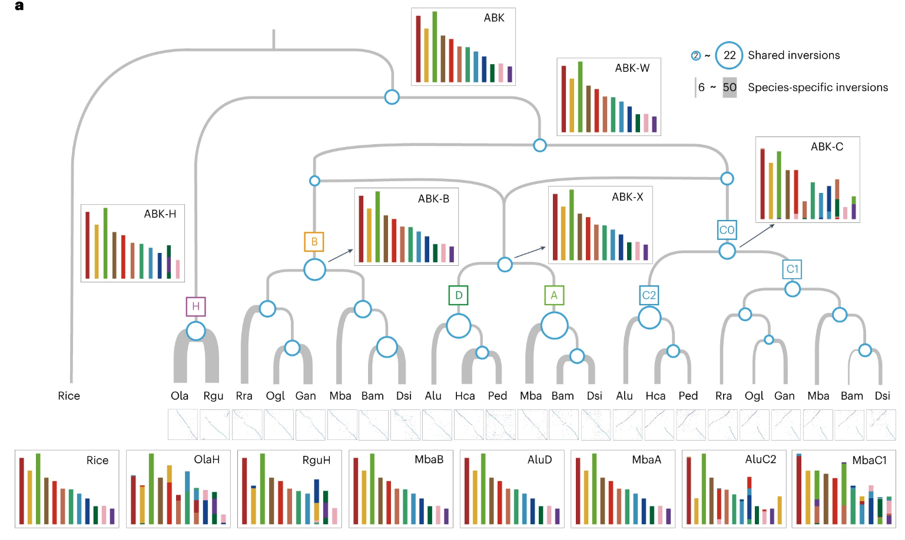
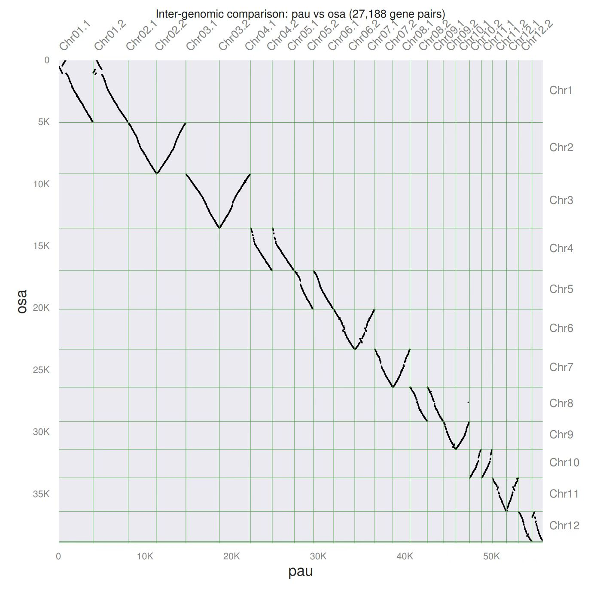

# Karyotype Evolution Protocol

## Folder Structure
This module contains the source data and analytical scripts used to reconstruct the ancestral grass karyotype (AGK) and trace chromosomal rearrangements across major grass lineages.

* **`Species/`**: Contains the input genomic data (e.g., coding sequences, annotations) for the diverse grass species and outgroup taxa used in our comparative analyses.

| Abbreviation | Scientific Name | Subfamily |
| :--- | :--- | :--- |
| **stSp** | *Streptochaeta spicata* | Anomochlooideae |
| **phLa** | *Pharus latifolius* | Pharoideae |
| **olLa** | *Olyra latifolia* | Bambusoideae |
| **raGu** | *Raddia guianensis* | Bambusoideae |
| **lePe** | *Leersia perrieri* | Oryzoideae |
| **orSa** | *Oryza sativa* | Oryzoideae |
| **aeBi** | *Aegilops bicornis* | Pooideae |
| **aeSh** | *Aegilops sharonensis* | Pooideae |
| **avAt** | *Avena atlantica* | Pooideae |
| **brDi** | *Brachypodium distachyon* | Pooideae |
| **brSt** | *Brachypodium stacei* | Pooideae |
| **hoMa** | *Hordeum marinum* | Pooideae |
| **loPe** | *Lolium perenne* | Pooideae |
| **puTe** | *Puccinellia tenuiflora* | Pooideae |
| **seCe** | *Secale cereale* | Pooideae |
| **thEl** | *Thinopyrum elongatum* | Pooideae |
| **alse** | *Alloteropsis semialata* | Panicoideae |
| **coLa** | *Coix lacryma-jobi* | Panicoideae |
| **ecHa** | *Echinochloa haploclada* | Panicoideae |
| **erOp** | *Eremochloa ophiuroides* | Panicoideae |
| **paHa** | *Panicum hallii* | Panicoideae |
| **saSp** | *Saccharum spontaneum* | Panicoideae |
| **seVi** | *Setaria viridis* | Panicoideae |
| **soBi** | *Sorghum bicolor* | Panicoideae |
| **erCu** | *Eragrostis curvula* | Chloridoideae |
| **orTh** | *Oropetium thomaeum* | Chloridoideae |

* **`Ancestral_Grass_Karyotype/`**: Houses the reconstructed ancestral grass karyotypes. To facilitate replication and further research, we provide the ancestral gene order and sequence formatted for both `jcvi` and `wgdi` input requirements.
* **`Karyotype_Mapping/`**: Contains the vector-format karyotype diagrams presented in Figure 4. These figures visualize the macro-syntenic mapping results, illustrating the synteny blocks, breakpoints, and collinearity data that demonstrate the relationship between the post-ρ AGK and extant grass species.

## Evolutionary Trajectory from Post-ρ AGK to Major Subfamilies
Starting from the post-ρ AGK (12 protochromosomes), the karyotypes exhibit distinct lineage-specific evolutionary patterns.

### Post-ρ AGK Inference
By comparing the genomes of S. spicata, P. latifolius, and rice, it was determined that the post-ρ AGK is nearly identical to rice because rice retains the conserved ancestral whole-chromosome collinearity, whereas the structural rearrangements seen in the other two early-diverging grasses are lineage-specific derived events.

### **BOP Clade Dynamics**:
  * **Oryzoideae**: Maintained extremely conserved karyotypes with little to no change up to their respective crown nodes.
  * **Bambusoideae**: Identical to the post-ρ AGK.
    
  * **Pooideae**: Experienced extensive structural changes.
    * **Brachypodieae** ：Underwent two nested chromosome fusion (NCF) events.
    * **Poaeae**: The lineage underwent 1 end-end joining (EEJ) and 4 nested chromosome fusion (NCF) events. This reduced the chromosome number to 7.
    * **Triticeae**: Underwent an additional reciprocal translocation (RT) event following its divergence from the ancestral node of Poaeae and Triticeae.
### **PACMAD Clade Dynamics**:
  * **Arundinoideae**: Identical to the post-ρ AGK, demonstrated by the complete chromosomal collinearity between Phragmites australis and rice.
    
  * **Chloridoideae & Panicoideae**: The crown nodes of these subfamilies followed a shared trajectory, experiencing 1 RT, 1 EEJ, and 1 NCF event. This sequence resulted in a chromosome number reduction from 12 to 10. 
